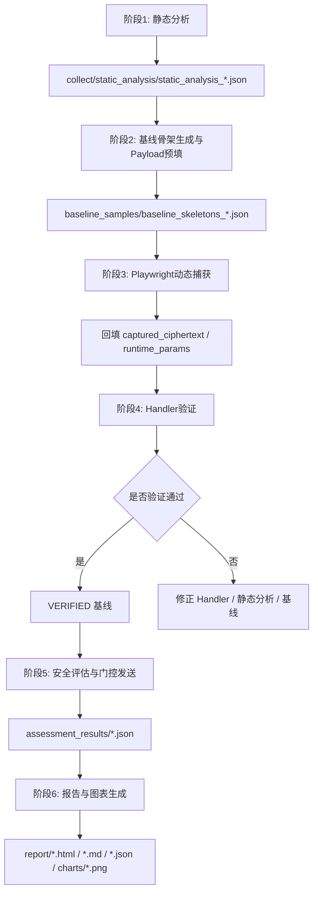

# 🔒 Reverse Analysis and Automated Security Assessment of Web API

一个面向毕业设计场景的 Web API 前端加密逆向与自动化安全评估流水线。

当前项目采用**统一基线 JSON** 作为主线数据结构，完整闭环为：

**静态分析 → 基线骨架生成 → Payload 预填 → Playwright 动态捕获 → Handler 本地验证 → 安全性评估 → 报告与图表生成**

最终答辩版对外口径统一为：
- **项目统一入口**：`main.py`
- **内部阶段编排层**：`phases/`
- **核心实现层**：`collect/`、`scripts/`、`handlers/`、`assess/`、`runtime/`

---

## 1. 项目目标

本项目主要解决以下问题：

1. 收集并规范化前端 JavaScript，识别页面触发的 API 与加密逻辑。
2. 通过 AST 静态分析提取原语级步骤，包括 `init`、`setkey`、`setiv`、`encrypt`、`sign`、`derive_*`、`pack` 等。
3. 基于静态分析结果生成统一基线文件，一个静态分析结果对应一个 `baseline_skeletons_*.json`，其中包含多个 API 基线记录。
4. 在基线中预填有效 Payload，使后续浏览器捕获与 Handler 验证使用同一输入源。
5. 通过 Playwright Hook 捕获真实运行时参数与密文，回填 Key / IV / Nonce / 时间戳 / 签名材料等信息。
6. 用本地 Handler 逐步模拟加密过程并校验正确性。
7. 在已验证基线上执行多场景安全评估，覆盖重放、参数变异、边界值、协议参数篡改等测试；阶段5按统一门控规则决定场景是否进入在线验证。
8. 输出结构化报告与图表，供毕业设计展示与论文撰写使用。

---

## 2. 当前推荐架构

当前代码层面采用**两层结构**：

### 2.1 统一阶段入口层
集中放在 `phases/` 目录，负责：
- 按阶段编排
- 统一参数入口
- 串行执行完整链路
- 降低脚本散落带来的使用成本

### 2.2 核心实现层
核心实现继续保留在以下目录中：
- `collect/`
- `scripts/`
- `handlers/`
- `assess/`
- `runtime/`

这样做的好处是：
- 不需要大规模迁移旧代码
- 兼容当前已有实现
- 对外入口统一，对内职责仍清晰

---

## 3. 工作流总览



---

## 4. 推荐入口

### 4.1 一键全链路（推荐）
```bash
python main.py --url http://encrypt-labs-main-1/generated_layer1_sample.php --username admin --password 123456
```

说明：
- 这是**最终答辩版推荐说法**：从项目根目录 `main.py` 进入。
- `main.py` 内部会转发到 `phases/run_full_pipeline.py`。

### 4.1.1 推荐日志方式（避免 PowerShell 重定向乱码）
```bash
python main.py --url http://encrypt-labs-main-1/generated_layer1_sample.php --username admin --password 123456 --log-file runtime/full_pipeline_utf8.log
```

说明：
 - 推荐使用 `--log-file` 让总控入口在 Python 内部按 **UTF-8** 写日志。
 - 不建议依赖 PowerShell 的 `>` / `2>&1` 做主日志，因为 Windows 下这类重定向常会生成 UTF-16/控制台编码混杂日志，看起来像“中文乱码”或夹杂空字符。

### 4.1.2 配置阶段5在线验证参数（可选）
```bash
python main.py --url http://encrypt-labs-main-1/generated_layer1_sample.php --username admin --password 123456 --phase5-timeout 10 --phase5-include-unverified
```

说明：
- 阶段5固定为“真实目标验证”单一路径。
- 不可落地场景按门控标记为 `UNMUTATABLE` 或 `MUTATION_NOT_EFFECTIVE`，并记录跳过原因。
- `--phase5-timeout` 用于控制阶段5真实发包的超时时间；`--phase5-include-unverified` 用于诊断阶段性数据问题。

### 4.1.3 内部阶段入口（用于开发与调试）
```bash
python phases/run_full_pipeline.py --layer 1 --username admin --password 123456
```

或显式指定 URL：

```bash
python phases/run_full_pipeline.py --url http://encrypt-labs-main-1/generated_layer1_sample.php --username admin --password 123456
```

说明：
- `phases/` 是**内部阶段编排层**。
- 日常开发、单阶段调试可以直接使用 `phases/` 下入口。

---

## 5. 各阶段入口与核心实现映射

| 阶段 | 推荐入口 | 核心实现 |
|---|---|---|
| Phase 0 | `phases/phase0_setup_env.ps1` | `scripts/setup_env.ps1` |
| Phase 1 | `phases/phase1_static_analysis.py` | `collect/static_analyze.py` |
| Phase 2 | `phases/phase2_prepare_baseline.py` | `scripts/init_baselines.py` |
| Phase 3 | `phases/phase3_capture.py` | `scripts/capture_baseline_playwright.py` |
| Phase 4 | `phases/phase4_verify_handlers.py` | `scripts/verify_handlers.py` |
| Phase 5 | `phases/phase5_assess.py` | `assess/assess_endpoint.py` |
| Phase 6 | `phases/phase6_generate_report.py` | `assess/report_gen.py`、`runtime/generate_profile_charts.py` |

说明：
- `phases/` 目录是新的**统一阶段入口层**。
- 原来的 `collect/`、`scripts/`、`assess/`、`runtime/` 中脚本现在主要作为**核心实现层**保留。

---

## 6. 验证口径说明

### 6.1 确定性算法
如：
- AES
- DES
- HMAC

要求：
- `handler_ciphertext` 与 `captured_ciphertext` 严格一致
- 验证结果标记为 `MATCH`

### 6.2 非确定性密文算法
如：
- RSA
- AESRSA

要求：
- 不强求逐字节密文一致
- 只要原语链路、输入、公钥和打包流程正确，就可标记为：
  - `RSA_NONDETERMINISTIC_LOGIC_VALIDATED`

### 6.3 服务端签名 / 前端仅打包端点
如：
- `signdataserver`
- `norepeater`

要求：
- 不按“本地重算签名值”验证
- 重点验证最终请求体字段组装与运行时参数回填
- 验证结果标记为：
  - `NO_CRYPTO`

补充说明：
- `PayloadPacking` 在报告中按“流水线步骤”处理，不作为加密算法展示。

---

## 7. 安全评估说明

基于已验证的基线进行多场景测试，当前重点包括：

- 基线重放
- 明文参数注入 / 语义变异
- 空值 / 超长值 / 特殊字符 / 类型错配 / 缺字段
- 协议参数篡改（IV / Nonce / 时间戳 / 签名 / 密文字段）
- 请求体回退篡改（必要时回退使用 `validation.trace` 中捕获的 `FETCH body`）

口径补充（特例）：
- 对 `PasswordPreHash`（前端口令预哈希）类端点，阶段5仅保留认证抗性场景（重放/时效/nonce/凭据一致性），并允许跳过 handler 缺失门槛；评分中不计 handler 缺失类罚分，但保留认证抗性场景失败扣分。

RSA 场景补充：
- 本地 Handler 对超长 RSA 明文采用分块加密，避免因 `Plaintext is too long` 直接导致场景本地失败。
- 分块仅用于评估阶段提升覆盖率；是否被服务端接受仍以后续真实响应为准。

### 7.1 新评估口径（固定在线验证）

阶段5现在只保留一条评估路径：**先门控可变异性，再在线发送，再按远程预期命中扣分**。

1. **端点动态性检测（先判定是否依赖动态/服务端字段）**
   - 读取 `validation.dynamic.observed`、`validation.dynamic_observed`、`meta.dynamic_endpoint_hint`。
   - 两段式优先：
     - 阶段2静态提示（`dynamic.hint`）提供候选动态字段和服务端中间请求线索；
     - 阶段3动态实证（`dynamic.observed`）确认是否实际观测到动态行为。
   - 强动态字段（如 `nonce/timestamp/signature/token/random`）命中时直接判定动态。
   - 弱动态字段（如 `key/iv/message`）必须结合 hint/observed 理由联合判定，避免把固定 Key/IV 的静态端点误判为动态端点。
   - 缺少两段式字段时，阶段5仅做兜底推断（`trace/hints/execution_flow`），并建议回溯阶段2/3补齐证据字段。

2. **capture 使用策略（按端点类型分流）**
   - 静态端点：维持“本地执行流重建请求包 + 在线发送”现状。
   - 动态端点：
     - 服务端依赖型（存在 server intermediate fetch）：每个场景 fresh capture 一次，再变异并发送；
     - 非服务端依赖型：每个端点 fresh capture 一次后复用，再执行各场景变异发送。
   - 性能实现：服务端依赖型端点的场景级 fresh capture 采用“单浏览器进程 + 多场景并发 context”执行，降低重复启动浏览器开销。
   - 对服务端依赖型动态端点启用会话连续性模式：发送时复用 capture 回填的会话 cookie。
   - 若变异未映射到最终请求包，标记 `MUTATION_NOT_EFFECTIVE` 并跳过该场景。

3. **状态机可变异性判定（门控）**
   - 可变异且可发送：进入在线验证。
   - 不可变异：标记 `UNMUTATABLE`。
   - 变异未落地：标记 `MUTATION_NOT_EFFECTIVE`。
   - 以上门控场景会保留诊断信息，但不作为“远程预期未命中”扣分对象。

4. **在线请求发送与响应归类**
   - 对可发送场景执行真实请求（静态端点来自本地重建；动态端点来自场景级 fresh capture 后的变异包）。
   - 远程结果统一归类为三层标签：协议层 / 结构层 / 语义层，并融合为 `response_mode`。

5. **评分扣分逻辑（远程命中驱动）**
   - 每个场景先计算 `matched`（远程模式命中或三层规则命中）。
   - `matched = False` 时触发 `expectation_mismatch_penalties`（按场景类别加权）。
   - `matched = True` 且配置 `waive_penalty_on_match` 时，该场景不扣分。
   - 本地结果仅用于门控分类（如 `UNMUTATABLE`、`MUTATION_NOT_EFFECTIVE`），不参与命中判定。
   - 若端点属于“服务端依赖型动态端点”且检测到跨会话重放仍成功，则追加“会话绑定缺失”扣分（仅适用端点）。

### 7.2 阶段3动态捕获 与 阶段5在线验证的职责边界

1. **阶段3 Playwright 动态捕获**
   - 负责获取真实运行时参数、密文与请求轨迹，解决“是否能重建请求链路”的问题。

2. **阶段5 安全评估在线验证**
   - 负责在可发送场景下对目标 API 做真实请求，并依据远程结果进行预期命中判定与评分扣分。

因此：阶段3是数据回填与链路还原，阶段5是安全判定与风险计分；两者串联，不互相替代。

### 7.3 SKIPPED 的含义

报告中的 `SKIPPED` 不是泛泛地“没跑”，而是**当前场景具备明确跳过原因**，例如：
- JSON 请求体无法表达重复字段
- 当前请求体里找不到要篡改的目标字段
- 缺少可用请求体，无法执行协议篡改

最终报告的场景状态会直接显示为：
- `crypto_duplicate_timestamp: SKIPPED（原因: JSON 请求体无法自然表达重复字段。）`

评分配置来自：
- `configs/scoring_profiles.yaml`

当前内置 profile：
- `default`
- `crypto_focus`
- `paper_v1`

论文展示推荐：
- `paper_v1`

评分说明文档：
- `configs/scoring_profiles.md`

### 7.4 单端点报文调试脚本

用于调试某个端点在阶段5中的“多场景”请求构造与响应：
- 原包（capture trace + baseline_replay 重建包）
- 每个场景的变异包（`scenario_packets[*].mutated_packet`）
- 每个场景的响应包（`scenario_packets[*].response_packet`）
- 每个场景的判定诊断（`judgement`：显示是否命中、命中依据是远程模式还是三层规则）

说明：
- `baseline_replay` 既是一个评估场景，也是原包重建的基准来源。
- 原包中的 `from_reconstructed_baseline` 用于提供“对照基线”；同时在 `scenario_packets` 中也会出现 `baseline_replay` 这一场景结果，二者用途不同，不冲突。

脚本位置：
- `scripts/debug_endpoint_packets.py`

示例：
```bash
python scripts/debug_endpoint_packets.py --endpoint-id aes
```

说明：
- 调试脚本按统一口径执行真实发包（用于直接观察远程响应）。

仅调试单一场景（可选）：
```bash
python scripts/debug_endpoint_packets.py --endpoint-id aes --scenario-id crypto_signature_corruption
```

可选输出到文件：
```bash
python scripts/debug_endpoint_packets.py --endpoint-id aes --scenario-id payload_missing_field --output-json runtime/debug_packets_aes.json
```

双分制评分补充：
- 评估结果除 `overall_score` 外，还会输出：
  - `protocol_score`（协议层风险分）
  - `business_score`（业务层风险分）
- 双分制权重来自 `configs/scoring_profiles.yaml` 的 `layer_score_weights`。

错误语义聚类补充：
- 阶段5会对响应模式做语义归类（如 `APP_INVALID_INPUT`、`APP_MISSING_DATA`、`APP_DECRYPT_FAIL`、`APP_REJECTED`、`APP_SUCCESS`），用于全局统计与热力图分析；端点主表改为展示“远程响应命中明细 + 实际响应”，本地失败仅做备注。

三层判定口径（去 AI）：
- 协议层：`NOT_ATTEMPTED` / `TRANSPORT_ERROR` / `HTTP_4XX` / `SERVER_5XX` / `HTTP_2XX`
- 结构层：`JSON_APP_STRUCTURED` / `JSON_OBJECT` / `JSON_ARRAY` / `HTML_TEXT` / `PLAIN_TEXT` / `BODY_EMPTY`
- 语义层：基于关键词规则匹配（如 `invalid` / `missing` / `decrypt` / `"success":true`）
- 语义层补充：当响应体为 `{"success":false}` 时，会归类为 `APP_REJECTED`（业务拒绝），不再误判为 `APP_SUCCESS`。
- 最终 `response_mode` 由三层融合规则生成，不依赖 AI 语义模型。
- 诊断口径：`baseline_replay` 默认要求成功（`APP_SUCCESS`）。若网站响应风格差异较大，但命中预设三层规则（`response_layer_any_of`），同样视为命中，不触发“预期未命中扣分”。

### 7.5 评估判定逻辑（泛化 + 诊断）

阶段5对每个场景采用二元判定（命中 / 未命中），并用于评分：

1. **先归一化实际结果**
   - 通过三层规则得到：
     - `actual_remote_mode`
     - `actual_response_layers = {protocol, structure, semantic}`

2. **再与预期对比**
   - 远程模式匹配：
     - `remote_mode_match = (actual_remote_mode in expected_remote_modes)`
   - 三层规则匹配（诊断）：
     - `response_layer_match = OR(response_layer_any_of)`
     - 该字段用于解释响应特征，不参与最终命中计算。

3. **最终命中判定**
   - `matched = remote_mode_match`
   - 若未配置 `expected_remote_modes`，则 `matched = None`（未评估）。

4. **动态端点发送策略（简化版）**
   - 服务端依赖型动态端点：每场景 fresh capture，不复用上一场景动态材料。
   - 非服务端依赖型动态端点：每端点 fresh 一次后复用，减少阶段5重复捕获开销。
   - 所有动态端点均在 fresh 样本上再变异并发送，避免污染基线对照。

5. **评分规则（诊断导向）**
   - `matched = True`：不触发预期未命中扣分。
   - `matched = False`：触发 `expectation_mismatch_penalties`。
   - `baseline_replay` 采用更高的未命中惩罚（用于诊断 API 基线健壮性）。

这套逻辑兼顾了：
- **诊断性**：基线重放必须成功，否则扣分。
- **泛化性**：不同网站响应风格可通过三层规则命中避免误罚。

### 7.6 Layer3 量化办法（分桶对照 + 可观测增益）

Layer3 不再依赖 `validation_hops` 做远程预期细分，而是采用**分桶对照 + 可观测增益**的方式做量化：

1. **分桶键**
   - `algorithm_stack + anti_replay + material_source + packaging`

2. **每桶抽样**
   - 每个桶尽量抽 `4` 个基样本；不足 4 个则全取。
   - 优先覆盖多个桶，避免只在单一算法上放大样本。

3. **对照与试验**
   - 对照组：无夹层样本。
   - 试验组：`HEADER_SIGN_LAYER` 样本。
   - `ENCODING_LAYER` 仅作为边界样本，不作为主量化对象。

4. **量化指标**
   - `RejectLikeRate = (APP_INVALID_INPUT + APP_MISSING_DATA + APP_DECRYPT_FAIL + APP_REJECTED + HTTP_4XX) / 可发送场景数`
   - `ISG = RejectLikeRate(interlayer) - RejectLikeRate(control)`

5. **解释口径**
   - 夹层信号只用于样本分层、可观测复杂度量化与报告解释。
   - 远程预期仍保持通用规则，不因是否存在夹层而频繁改写。

6. **三态公平计分（无夹层 / 夹层有效 / 夹层失效）**
   - 状态定义：
     - `no_interlayer`：端点无夹层信号，按常规规则计分。
     - `interlayer_effective`：存在夹层信号，且关键场景全部通过。
     - `interlayer_invalid`：存在夹层信号，关键场景中任一场景失败。
   - 关键场景规则：当前对 `HEADER_SIGN_LAYER` 采用 `crypto_remove_security_field` 与 `crypto_signature_corruption`；只要出现一次 `matched=False`、`SKIPPED` 或 `LOCAL_FAILED`，即判定为 `interlayer_invalid`。
   - 计分方式：不改 `expected_outcome.remote_response_modes`；仅在评分时消费夹层状态（状态乘子 + 端点级附加惩罚），保证与无夹层端点共用同一远程预期口径。

---

## 8. 图表输出

阶段 6 会同步生成 7 张图表，输出到：
- `report/charts/`

包括：
1. `validation_comparison_distribution.png`
2. `endpoint_security_scores.png`
3. `profile_score_comparison.png`
4. `endpoint_scenario_state_machine_matrix.png`
5. `endpoint_scenario_expectation_hit_matrix.png`
6. `remote_execution_overview.png`
7. `scenario_response_mode_heatmap.png`

其中新增的在线评估图表重点对应阶段5真实目标验证：
- `remote_execution_overview.png`：在线验证执行总览
- `scenario_response_mode_heatmap.png`：场景类别到响应模式的热力图

新增预期命中图：
- `endpoint_scenario_expectation_hit_matrix.png`：每个端点在各场景下是否命中远程响应预期（命中/未命中/未定义预期/无该场景）

新增门控矩阵图：
- `endpoint_scenario_state_machine_matrix.png`：每个端点在每个场景下落入的状态机门控类型（多色分类矩阵，便于快速定位哪个场景被 `UNMUTATABLE` 或 `MUTATION_NOT_EFFECTIVE`）。

---

## 9. 目录结构

```text
.
├── assess/                         # 安全评估与报告生成核心实现
├── baseline_samples/               # 统一基线文件
├── collect/                        # 静态分析与 AST 检测核心实现
├── configs/                        # 全局配置、阶段配置、评分配置
├── handlers/                       # 本地 Handler 与流水线执行框架
├── phases/                         # 统一阶段入口层（推荐从这里执行）
│   ├── common.py
│   ├── phase0_setup_env.ps1
│   ├── phase1_static_analysis.py
│   ├── phase2_prepare_baseline.py
│   ├── phase3_capture.py
│   ├── phase4_verify_handlers.py
│   ├── phase5_assess.py
│   ├── phase6_generate_report.py
│   └── run_full_pipeline.py
├── report/                         # 最终报告与图表输出
├── replay/                         # 参数变异与请求重放辅助模块
├── runtime/                        # 运行时辅助文件（Playwright Hook、图表脚本、UTF-8 日志）
│   ├── playwright_hook.js
│   ├── generate_profile_charts.py
│   └── full_pipeline_utf8.log
├── scripts/                        # 仍被 phases 调用的核心实现脚本（非推荐直接入口）
│   ├── init_baselines.py
│   ├── capture_baseline_playwright.py
│   ├── verify_handlers.py
│   └── setup_env.ps1
├── main.py                         # 项目对外统一入口（最终答辩版从这里进入）
├── plan-reverseAnalysisPipeline.prompt.md
├── README.md
└── requirements.txt
```

---

## 9.1 脚本功能说明（用于“内容与实施方案”撰写）

### 顶层入口

- `main.py`
  - 项目对外统一入口。
  - 内部调用 `phases/run_full_pipeline.py` 组织全流程执行。

### 阶段编排层（`phases/`）

- `phases/phase0_setup_env.ps1`
  - 环境初始化入口，安装依赖并准备运行环境。
- `phases/phase1_static_analysis.py`
  - 执行静态分析，产出 `collect/static_analysis/static_analysis_*.json`。
- `phases/phase2_prepare_baseline.py`
  - 基于最新静态分析生成统一基线骨架（多端点同文件）。
- `phases/phase3_capture.py`
  - 调用 Playwright 动态捕获，回填运行时参数与密文。
- `phases/phase4_verify_handlers.py`
  - 使用本地 Handler 对基线逐端点进行正确性验证。
- `phases/phase5_assess.py`
  - 执行安全评估场景（统一门控后按可落地性决定是否在线发送）。
- `phases/phase6_generate_report.py`
  - 汇总 assessment 结果，生成报告与图表。
- `phases/run_full_pipeline.py`
  - 一键串联阶段1-6，供全链路执行。

### 核心实现层（`scripts/`、`collect/`、`assess/`、`runtime/`）

- `scripts/init_baselines.py`
  - 读取 `collect/static_analysis/` 最新结果，生成 `baseline_samples/baseline_skeletons_*.json`。
  - 负责 `packing_info` 的结构归一化（含 `field_sources`、`value_derivations`）。
- `scripts/capture_baseline_playwright.py`
  - 浏览器端触发各 API，捕获加密过程与 `fetch` 请求体，回填基线验证区。
- `scripts/verify_handlers.py`
  - 以统一基线为输入运行 Handler 流水线，并回写验证状态与比对结果。

- `collect/ast_detect_crypto.js`
  - AST 级别识别加密原语步骤与请求打包逻辑。
  - 输出 `details`，供后续构造 `execution_flow` 使用。
- `collect/static_analyze.py`
  - 聚合静态分析结果，建立“端点 -> 算法/操作/调用痕迹”映射。

- `assess/assess_endpoint.py`
  - 评估引擎核心：场景构造、请求篡改、在线验证发送、风险评分。
  - 产出双分制评分（`overall_score`、`protocol_score`、`business_score`）与错误语义聚类。
- `assess/report_gen.py`
  - 读取 assessment + baseline + static analysis，生成 HTML/Markdown/JSON 报告。

- `runtime/playwright_hook.js`
  - 浏览器注入 Hook，捕获前端加密输入输出、密钥材料与网络请求信息。
- `runtime/generate_profile_charts.py`
  - 从评估结果生成论文展示图表（含响应模式热力图）。

### Handler 执行层（`handlers/`）

- `handlers/pipeline.py`
  - 将单端点基线转为可执行流水线，按 step 执行。
- `handlers/operations.py`
  - 各原语实现（AES/DES/RSA/HMAC 等）与派生逻辑执行。
- `handlers/validator.py`
  - 校验流程产物与规则约束，支撑阶段4验证。
- `handlers/registry.py`
  - 原语注册与查找中心。
- `handlers/handlers.md`
  - Handler 设计说明、验证口径与边界条件文档。

---

## 10. 环境准备

### Python / Node / Playwright
```bash
python -m venv .venv
.venv\Scripts\activate
pip install -r requirements.txt
npm install
python -m playwright install chromium
```

### PowerShell 快速初始化
```powershell
.\phases\phase0_setup_env.ps1
```

---

## 11. 当前建议的使用方式

如果你只是想跑毕业设计主链路，推荐固定使用：

- 用户名：`admin`
- 密码：`123456`
- URL：`http://encrypt-labs-main-1/generated_layer1_sample.php`

直接执行：
```bash
python main.py --url http://encrypt-labs-main-1/generated_layer1_sample.php --username admin --password 123456
```
 
 如果需要保存可读日志，推荐：
```bash
python main.py --url http://encrypt-labs-main-1/generated_layer1_sample.php --username admin --password 123456 --log-file runtime/full_pipeline_utf8.log
```

---

## 12. 当前注意事项

1. `baseline_samples/` 中可能存在临时验证文件（如 `.tmp_verify.json`），正式运行时优先使用正式基线文件。
2. 对外展示时推荐统一表述为：`main.py` 是项目入口，`phases/` 是内部阶段编排层。
3. 旧脚本目录仍保留，是为了兼容与复用核心实现；日常答辩展示不建议直接从 `scripts/` 进入。
4. 如果某个阶段失败，应优先回溯前一阶段产物，而不是跳过继续执行。
5. 如果需要保留运行日志，请优先使用 `--log-file runtime/full_pipeline_utf8.log`，不要把 PowerShell 重定向日志作为主日志来源。
6. 阶段5采用固定在线验证口径；若场景未发送，通常由门控结果（如 `UNMUTATABLE`、`MUTATION_NOT_EFFECTIVE`）或链路问题触发。
7. 如果 Markdown/IDE 对 README 的目录锚点有警告，一般不影响项目实际运行。

---

## 13. 相关说明文档

- 总体阶段计划：`plan-reverseAnalysisPipeline.prompt.md`
- Handler 说明：`handlers/handlers.md`
- 评分配置说明：`configs/scoring_profiles.md`
- 三层判定规则说明：`assess/response_layer_rules.md`

---

## 14. 一句话总结

现在推荐的实际使用方式是：
 
> **对外从 `main.py` 进入；内部由 `phases/` 串行编排完整链路；旧目录中的脚本继续作为核心实现保留。**

---

## 产物结构说明

本项目各阶段产物结构与字段解释，详见各目录下的说明文档：

- [assessment_results/README.md](assessment_results/README.md)：安全评估结果产物结构说明
- [baseline_samples/README.md](baseline_samples/README.md)：基线样本产物结构说明
- [collect/static_analysis/README.md](collect/static_analysis/README.md)：静态分析产物结构说明
- [report/README.md](report/README.md)：最终报告与图表产物结构说明

如需了解各阶段产物的详细结构、字段含义及用途，请查阅对应目录下的说明文档。

---

