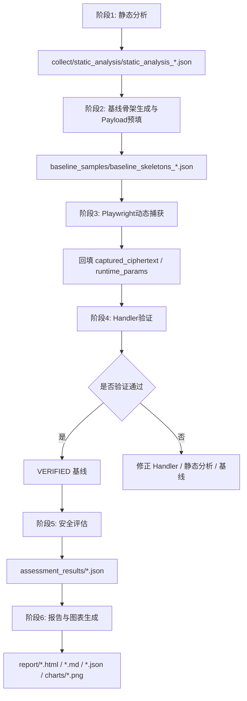

# 🔒 Reverse Analysis and Automated Security Assessment of Web API

一个面向毕业设计场景的 Web API 前端加密逆向与自动化安全评估流水线。

当前项目采用**统一基线 JSON** 作为主线数据结构，完整闭环为：

**静态分析 → 基线骨架生成 → Payload 预填 → Playwright 动态捕获 → Handler 本地验证 → 安全性评估 → 报告与图表生成**

最终答辩版对外口径统一为：
- **项目统一入口**：`main.py`
- **内部阶段编排层**：`phases/`
- **核心实现层**：`collect/`、`scripts/`、`handlers/`、`assess/`、`runtime/`

---

## 1. 项目目标

本项目主要解决以下问题：

1. 收集并规范化前端 JavaScript，识别页面触发的 API 与加密逻辑。
2. 通过 AST 静态分析提取原语级步骤，包括 `init`、`setkey`、`setiv`、`encrypt`、`sign`、`derive_*`、`pack` 等。
3. 基于静态分析结果生成统一基线文件，一个静态分析结果对应一个 `baseline_skeletons_*.json`，其中包含多个 API 基线记录。
4. 在基线中预填有效 Payload，使后续浏览器捕获与 Handler 验证使用同一输入源。
5. 通过 Playwright Hook 捕获真实运行时参数与密文，回填 Key / IV / Nonce / 时间戳 / 签名材料等信息。
6. 用本地 Handler 逐步模拟加密过程并校验正确性。
7. 在已验证基线上执行多场景安全评估，覆盖重放、参数变异、边界值、协议参数篡改等测试。
8. 输出结构化报告与图表，供毕业设计展示与论文撰写使用。

---

## 2. 当前推荐架构

当前代码层面采用**两层结构**：

### 2.1 统一阶段入口层
集中放在 `phases/` 目录，负责：
- 按阶段编排
- 统一参数入口
- 串行执行完整链路
- 降低脚本散落带来的使用成本

### 2.2 核心实现层
核心实现继续保留在以下目录中：
- `collect/`
- `scripts/`
- `handlers/`
- `assess/`
- `runtime/`

这样做的好处是：
- 不需要大规模迁移旧代码
- 兼容当前已有实现
- 对外入口统一，对内职责仍清晰

---

## 3. 工作流总览



---

## 4. 推荐入口

### 4.1 一键全链路（推荐）
```bash
python main.py --url http://encrypt-labs-main/easy.php --username admin --password 123456
```

说明：
- 这是**最终答辩版推荐说法**：从项目根目录 `main.py` 进入。
- `main.py` 内部会转发到 `phases/run_full_pipeline.py`。

### 4.1.1 推荐日志方式（避免 PowerShell 重定向乱码）
```bash
python main.py --url http://encrypt-labs-main/easy.php --username admin --password 123456 --log-file runtime/full_pipeline_utf8.log
```

说明：
 - 推荐使用 `--log-file` 让总控入口在 Python 内部按 **UTF-8** 写日志。
 - 不建议依赖 PowerShell 的 `>` / `2>&1` 做主日志，因为 Windows 下这类重定向常会生成 UTF-16/控制台编码混杂日志，看起来像“中文乱码”或夹杂空字符。

### 4.1.2 内部阶段入口（用于开发与调试）
```bash
python phases/run_full_pipeline.py --url http://encrypt-labs-main/easy.php --username admin --password 123456
```

说明：
- `phases/` 是**内部阶段编排层**。
- 日常开发、单阶段调试可以直接使用 `phases/` 下入口。

---

## 5. 各阶段入口与核心实现映射

| 阶段 | 推荐入口 | 核心实现 |
|---|---|---|
| Phase 0 | `phases/phase0_setup_env.ps1` | `scripts/setup_env.ps1` |
| Phase 1 | `phases/phase1_static_analysis.py` | `collect/static_analyze.py` |
| Phase 2 | `phases/phase2_prepare_baseline.py` | `scripts/init_baselines.py` |
| Phase 3 | `phases/phase3_capture.py` | `scripts/capture_baseline_playwright.py` |
| Phase 4 | `phases/phase4_verify_handlers.py` | `scripts/verify_handlers.py` |
| Phase 5 | `phases/phase5_assess.py` | `assess/assess_endpoint.py` |
| Phase 6 | `phases/phase6_generate_report.py` | `assess/report_gen.py`、`runtime/generate_profile_charts.py` |

说明：
- `phases/` 目录是新的**统一阶段入口层**。
- 原来的 `collect/`、`scripts/`、`assess/`、`runtime/` 中脚本现在主要作为**核心实现层**保留。

---

## 6. 验证口径说明

### 6.1 确定性算法
如：
- AES
- DES
- HMAC

要求：
- `handler_ciphertext` 与 `captured_ciphertext` 严格一致
- 验证结果标记为 `MATCH`

### 6.2 非确定性密文算法
如：
- RSA
- AESRSA

要求：
- 不强求逐字节密文一致
- 只要原语链路、输入、公钥和打包流程正确，就可标记为：
  - `RSA_NONDETERMINISTIC_LOGIC_VALIDATED`

### 6.3 服务端签名 / 前端仅打包端点
如：
- `signdataserver`
- `norepeater`

要求：
- 不按“本地重算签名值”验证
- 重点验证最终请求体字段组装与运行时参数回填
- 验证结果标记为：
  - `NO_CRYPTO`

---

## 7. 安全评估说明

基于已验证的基线进行多场景测试，当前重点包括：

- 基线重放
- 明文参数注入 / 语义变异
- 空值 / 超长值 / 特殊字符 / 类型错配 / 缺字段
- 协议参数篡改（IV / Nonce / 时间戳 / 签名 / 密文字段）
- 请求体回退篡改（必要时回退使用 `validation.trace` 中捕获的 `FETCH body`）

评分配置来自：
- `configs/scoring_profiles.yaml`

当前内置 profile：
- `default`
- `crypto_focus`
- `paper_v1`

论文展示推荐：
- `paper_v1`

评分说明文档：
- `configs/scoring_profiles.md`

---

## 8. 图表输出

阶段 6 会同步生成 5 张图表，输出到：
- `report/charts/`

包括：
1. `workflow_overview.png`
2. `validation_comparison_distribution.png`
3. `endpoint_security_scores.png`
4. `profile_score_comparison.png`
5. `scenario_status_distribution.png`

---

## 9. 目录结构

```text
.
├── assess/                         # 安全评估与报告生成核心实现
├── baseline_samples/               # 统一基线文件
├── collect/                        # 静态分析与 AST 检测核心实现
├── configs/                        # 全局配置、阶段配置、评分配置
├── handlers/                       # 本地 Handler 与流水线执行框架
├── phases/                         # 统一阶段入口层（推荐从这里执行）
│   ├── common.py
│   ├── phase0_setup_env.ps1
│   ├── phase1_static_analysis.py
│   ├── phase2_prepare_baseline.py
│   ├── phase3_capture.py
│   ├── phase4_verify_handlers.py
│   ├── phase5_assess.py
│   ├── phase6_generate_report.py
│   └── run_full_pipeline.py
├── report/                         # 最终报告与图表输出
├── replay/                         # 参数变异与请求重放辅助模块
├── runtime/                        # 运行时辅助文件（Playwright Hook、图表脚本、UTF-8 日志）
│   ├── playwright_hook.js
│   ├── generate_profile_charts.py
│   └── full_pipeline_utf8.log
├── scripts/                        # 仍被 phases 调用的核心实现脚本（非推荐直接入口）
│   ├── init_baselines.py
│   ├── capture_baseline_playwright.py
│   ├── verify_handlers.py
│   └── setup_env.ps1
├── main.py                         # 项目对外统一入口（最终答辩版从这里进入）
├── plan-reverseAnalysisPipeline.prompt.md
├── README.md
└── requirements.txt
```

---

## 10. 环境准备

### Python / Node / Playwright
```bash
python -m venv .venv
.venv\Scripts\activate
pip install -r requirements.txt
npm install
python -m playwright install chromium
```

### PowerShell 快速初始化
```powershell
.\phases\phase0_setup_env.ps1
```

---

## 11. 当前建议的使用方式

如果你只是想跑毕业设计主链路，推荐固定使用：

- 用户名：`admin`
- 密码：`123456`
- URL：`http://encrypt-labs-main/easy.php`

直接执行：
```bash
python main.py --url http://encrypt-labs-main/easy.php --username admin --password 123456
```
 
 如果需要保存可读日志，推荐：
```bash
python main.py --url http://encrypt-labs-main/easy.php --username admin --password 123456 --log-file runtime/full_pipeline_utf8.log
```

---

## 12. 当前注意事项

1. `baseline_samples/` 中可能存在临时验证文件（如 `.tmp_verify.json`），正式运行时优先使用正式基线文件。
2. 对外展示时推荐统一表述为：`main.py` 是项目入口，`phases/` 是内部阶段编排层。
3. 旧脚本目录仍保留，是为了兼容与复用核心实现；日常答辩展示不建议直接从 `scripts/` 进入。
4. 如果某个阶段失败，应优先回溯前一阶段产物，而不是跳过继续执行。
5. 如果需要保留运行日志，请优先使用 `--log-file runtime/full_pipeline_utf8.log`，不要把 PowerShell 重定向日志作为主日志来源。
6. 如果 Markdown/IDE 对 README 的目录锚点有警告，一般不影响项目实际运行。

---

## 13. 相关说明文档

- 总体阶段计划：`plan-reverseAnalysisPipeline.prompt.md`
- Handler 说明：`handlers/handlers.md`
- 评分配置说明：`configs/scoring_profiles.md`

---

## 14. 一句话总结

现在推荐的实际使用方式是：
 
> **对外从 `main.py` 进入；内部由 `phases/` 串行编排完整链路；旧目录中的脚本继续作为核心实现保留。**

