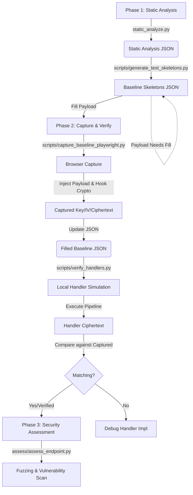

# 🔒 Reverse Analysis and Automated Security Assessment of Web API

[](https://www.python.org/downloads/)
[](https://opensource.org/licenses/MIT)

A comprehensive pipeline for reverse engineering front-end crypto implementations and automated security assessment of web APIs.

## 📋 Table of Contents

- [Overview](#overview)
- [Architecture](#architecture)
- [Installation](#installation)
- [Quick Start](#quick-start)
- [Pipeline Phases](#pipeline-phases)
- [Directory Structure](#directory-structure)
- [Usage Examples](#usage-examples)
- [Configuration](#configuration)
- [Development](#development)
- [Acceptance Criteria Checklist](#acceptance-criteria-checklist)
- [Contributing](#contributing)
- [License](#license)

## 🎯 Overview

This project provides a skeleton framework for:

1. **Capturing** baseline API requests from web applications
2. **Collecting** and analyzing JavaScript files for crypto patterns
3. **Detecting** cryptographic implementations (AES, RSA, HMAC, etc.)
4. **Replaying** requests with regenerated crypto parameters
5. **Mutating** parameters for security testing
6. **Assessing** endpoint security vulnerabilities
7. **Generating** comprehensive security reports

### Key Features

- 🔍 Automated JavaScript crypto pattern detection
- 🔐 Support for common crypto libraries (CryptoJS, JSEncrypt, etc.)
- 📊 Security scoring and vulnerability classification
- 📝 Multi-format report generation (HTML, Markdown, JSON)
- 🛠️ Extensible architecture with plugin support

## 🏗️ Architecture



│                                                                         │
│  输出：加密库识别、算法检测、AST 操作链步骤 (Pipeline Steps)               │
│                                                                         │
└─────────────────────────────────────────────────────────────────────────┘
                                    │
                                    ▼
┌─────────────────────────────────────────────────────────────────────────┐
│                         Phase 2-3: 基线骨架生成与完善                    │
├─────────────────────────────────────────────────────────────────────────┤
│                                                                         │
│  generate_test_skeletons.py ────► baseline_skeletons_*.json             │
│                                      (状态: PENDING_PAYLOAD)            │
│  verify_handlers.py -i ─────────► 填入 Request Payload                  │
│                                                                         │
└─────────────────────────────────────────────────────────────────────────┘
                                    │
                                    ▼
┌─────────────────────────────────────────────────────────────────────────┐
│                         Phase 4: 动态捕获与 Handler 验证                 │
├─────────────────────────────────────────────────────────────────────────┤
│                                                                         │
│  [Playwright Hook] (Future) ────► 捕获 captured_ciphertext              │
│          │                              │                               │
│          ▼                              ▼                               │
│  BaselinePipelineRunner ───────► 本地 Handler 执行 & 比对                │
│  (scripts/verify_handlers.py)  (handler_ciphertext vs captured)         │
│                                                                         │
│  输出：verify: true/false                                                │
│                                                                         │
└─────────────────────────────────────────────────────────────────────────┘
                                    │
                                    ▼
┌─────────────────────────────────────────────────────────────────────────┐
│                         Phase 5+: 安全评估与报告                         │
├─────────────────────────────────────────────────────────────────────────┤
│                                                                         │
│  参数变异 ──► 重放攻击 ──► 漏洞扫描 ──► 报告生成                           │
│                                                                         │
└─────────────────────────────────────────────────────────────────────────┘
## 🚀 Installation

### Prerequisites

- Python 3.8 or higher
- pip package manager
- Git

### Setup

1. **Clone the repository**
   ```bash
   git clone https://github.com/yuzheng0331/Reverse-Analysis-and-Automated-Security-Assessment-of-Web-API.git
   cd Reverse-Analysis-and-Automated-Security-Assessment-of-Web-API
   ```

2. **Create virtual environment**
   ```bash
   python -m venv .venv
   
   # Windows
   .venv\Scripts\activate
   
   # Linux/macOS
   source .venv/bin/activate
   ```

3. **Install dependencies**
   ```bash
   pip install -r requirements.txt
   ```

4. **Install Playwright browsers** (for browser-based capture)
   ```bash
   python -m playwright install chromium
   ```

5. **Configure environment**
   ```bash
   cp .env .env
   # Edit .env with your configuration
   ```

### Automated Setup (Optional)

**Windows (PowerShell):**
```powershell
.\scripts\setup_env.ps1
```

**Linux/macOS:**
```bash
chmod +x scripts/setup_env.sh
./scripts/setup_env.sh
```

## ⚡ Quick Start

### Phase 1: 静态分析 & 骨架生成
```bash
# 分析目标页面，生成静态分析结果
python collect/static_analyze.py --url http://encrypt-labs-main/
# 基于分析结果生成统一的基线骨架 (json)
python scripts/generate_test_skeletons.py
```

### Phase 2: 填充与验证 (Interactive)
1. 编辑 `baseline_samples/baseline_skeletons_*.json`，填入 `request.payload`。
2. 捕获真实数据：
   ```bash
   python scripts/capture_baseline_playwright.py
   ```
3. 验证本地 Handler：
   ```bash
   python scripts/verify_handlers.py
   ```

### Phase 3: 安全评估 (Assessment)
```bash
# 基于已验证的基线进行变异测试
python assess/assess_endpoint.py
```

## 📂 Pipeline Phases

### Phase 0: Environment Setup
**Scripts:** `scripts/setup_env.sh`, `scripts/setup_env.ps1`

Sets up the development environment including:
- Python virtual environment
- Dependencies installation
- Playwright browser setup
- Database connectivity check (optional)

### Phase 1: 静态分析与骨架 (Static Analysis & Skeleton)
**Script:** `collect/static_analyze.py`, `scripts/generate_test_skeletons.py`

一体化静态分析工具 + 基线骨架生成：
- **static_analyze.py**: 收集 HTML/JS，检测加密库和算法，建立端点映射。
- **generate_test_skeletons.py**: 将分析结果转换为标准化的 JSON 骨架 (`baseline_skeletons_*.json`)，包含操作步骤 (Pipeline Steps) 和 Hints。

```bash
python collect/static_analyze.py --url http://target/
python scripts/generate_test_skeletons.py
```

输出：`baseline_samples/baseline_skeletons_YYYYMMDD_HHMMSS.json` (Status: `PENDING_PAYLOAD`)。

### Phase 2: 动态捕获与验证 (Capture & Verify)
**Scripts:** `scripts/capture_baseline_playwright.py`, `scripts/verify_handlers.py`

构建并验证本地加密 Handler：
1. **Fill Payload**: 在 JSON 骨架中填入有效的测试数据（如用户名/密码）。
2. **Capture**: 运行 `scripts/capture_baseline_playwright.py`。
   - 使用 Playwright 注入 Payload。
   - Hook 浏览器加密函数，捕获运行时的 Key, IV, Nonce 和最终密文。
   - 回填到 JSON 文件。
3. **Verify**: 运行 `scripts/verify_handlers.py`。
   - 读取 JSON 中的 Payload 和 Captured Key/IV。
   - 在本地 Python 环境执行加密流水线。
   - 比对本地生成的密文与 Playwright 捕获的密文。

**目标**：确保本地 Handler 逻辑与浏览器端完全一致 (Ciphertext Match)，为后续 Fuzzing 打下基础。

### Phase 3+: 安全评估 (Security Assessment)
**Script:** `assess/assess_endpoint.py`

基于已验证的 Handler (Verified Skeletons) 进行安全性测试：
- 重放请求 (Replay)
- 参数变异 (Mutation)
- 漏洞扫描 (Assessment)
- 报告生成 (Report)
**(Note: Phase 4+ 尚未完全重构以适配新的基线骨架格式，敬请期待)**

## 📁 Directory Structure

```
.
├── baseline_samples/         # 统一存储基线骨架 (json)
│   └── baseline_skeletons_*.json
│
├── scripts/                  # 核心工具脚本
│   ├── setup_env.ps1         # 环境初始化
│   ├── generate_test_skeletons.py # 骨架生成工具
│   └── verify_handlers.py    # Handler 验证工具
│
├── collect/                  # 静态分析模块
│   └── static_analyze.py     # 一体化静态分析
│
├── handlers/                 # 加密 Handler 框架
│   ├── pipeline.py           # 核心流水线 (BaselinePipelineRunner)
│   ├── operations.py         # 加密算法实现
│   └── registry.py           # 算法注册表
│
├── replay/                   # (Pending Refactor) 请求重放
├── assess/                   # (Pending Refactor) 安全评估
├── report/                   # (Pending Refactor) 报告生成
│
├── configs/                  # 全局配置
│   ├── global.yaml
│   └── phases_config.yaml
│
├── tests/                    # 测试文件
│   └── test_smoke.py
│
├── docs/                     # 文档
│   └── HANDLER_COMPLETE.md
│
├── .env.example              # 环境变量模板
├── requirements.txt          # Python 依赖
├── main.py                   # 主入口
└── README.md                 # 本文件
```

## ⚙️ Configuration

### Environment Variables (`.env`)

Copy `.env.example` to `.env` and configure:

```bash
# Target application
TARGET_URL=https://example.com

# Database (optional)
DB_HOST=localhost
DB_PORT=3306
DB_NAME=api_assessment

# Playwright settings
PLAYWRIGHT_BROWSER=chromium
PLAYWRIGHT_HEADLESS=true
```

### Pipeline Configuration (`configs/phases_config.yaml`)

Configure pipeline phases, dependencies, and options in the YAML file.

## 🧪 Usage Examples

### Example 1: 完整分析流程 (Modern Workflow)

```bash
# 1. 静态分析 & 骨架生成
python collect/static_analyze.py --url http://encrypt-labs-main/
python scripts/generate_test_skeletons.py
# -> 生成 baseline_skeletons_*.json

# 2. 交互式填充 Payload 并验证 Handler
python scripts/verify_handlers.py --interactive
# -> 提示输入 Payload -> 自动本地运行 -> (如有基线) 自动比对

# 3. (后续) 安全评估
# python assess/assess_endpoint.py ...
```

### Example 2: 仅静态分析

```bash
# 快速分析目标页面的加密实现
python collect/static_analyze.py --url http://target.com/login.php --output my_analysis/
```

### Example 3: Test Parameter Mutations

```bash
# Generate mutations for login parameters
python replay/mutate_params.py --params '{"username":"test","password":"pass123","sign":"abc"}'

# Apply specific strategies
python replay/mutate_params.py --params '{"id":123}' --strategy injection crypto
```

## 👥 Development

### Running Tests

```bash
pytest tests/
```

### Code Style

The project follows PEP 8 guidelines. Format code with:

```bash
black .
isort .
```

### Adding New Crypto Signatures

Add signatures to `analysis/signature_db.py` or create a custom `configs/signatures.json`:

```json
{
  "signatures": [
    {
      "id": "CUSTOM_001",
      "name": "Custom Crypto Pattern",
      "category": "symmetric",
      "patterns": ["customEncrypt\\s*\\("],
      "weakness_level": "medium",
      "description": "Custom encryption function"
    }
  ]
}
```

## ✅ Acceptance Criteria Checklist

After merging this PR, verify the following:

### Environment Setup
- [ ] Clone the repository successfully
- [ ] Create virtual environment: `python -m venv .venv`
- [ ] Install dependencies: `pip install -r requirements.txt`
- [ ] Copy `.env.example` to `.env`
- [ ] Run setup script without errors

### Phase 1: 静态分析
- [ ] `python collect/static_analyze.py --url http://target.com` 运行成功
- [ ] 生成 `static_analysis/static_analysis_*.json` 文件
- [ ] JSON 包含：端点列表、加密模式、函数信息、端点-加密映射
- [ ] 识别出常见加密库（CryptoJS、JSEncrypt 等）
- [ ] 检测到安全弱点（如硬编码密钥、弱算法）

### Phase 2: 动态采集
- [ ] `python scripts/capture_baseline.py --url http://target.com` 执行成功
- [ ] 生成 `baseline_samples/baseline_*.json` 文件
- [ ] 基线样本包含真实的请求和响应数据

### Phase 3-4: 验证与测试
- [ ] 基于静态分析结果实现 Handler
- [ ] Handler 输出与基线样本中的密文一致
- [ ] `python replay/mutate_params.py --params '{"test":"value"}'` 生成变异
- [ ] `python assess/report_gen.py --format html` 创建 HTML 报告

### Code Quality
- [ ] All Python files have docstrings
- [ ] No hardcoded credentials in code
- [ ] `.env.example` contains only placeholders
- [ ] Import statements are properly organized

### Documentation
- [ ] README.md is complete and accurate
- [ ] All scripts have `--help` documentation
- [ ] Configuration files are documented

## 📄 License

This project is licensed under the MIT License - see the [LICENSE](LICENSE) file for details.

## 🤝 Contributing

Contributions are welcome! Please read our contributing guidelines before submitting PRs.

1. Fork the repository
2. Create a feature branch: `git checkout -b feature/new-feature`
3. Commit changes: `git commit -m 'Add new feature'`
4. Push to branch: `git push origin feature/new-feature`
5. Submit a Pull Request

---

**Note:** This is a skeleton/template project. Many functions contain TODO placeholders that need to be implemented for production use. The framework provides the structure and examples to guide development.
